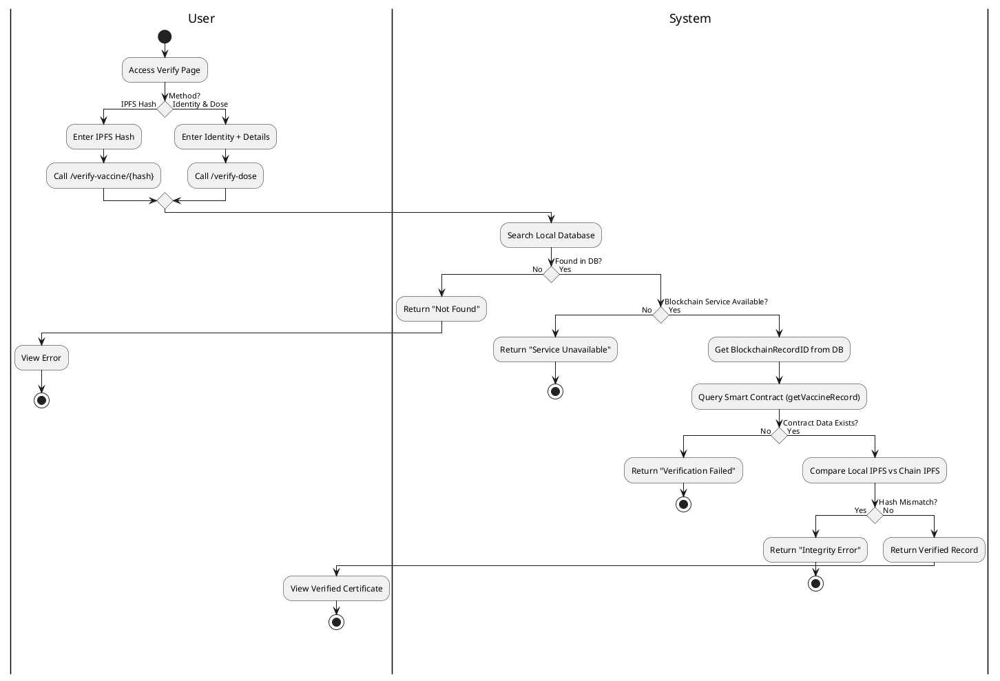
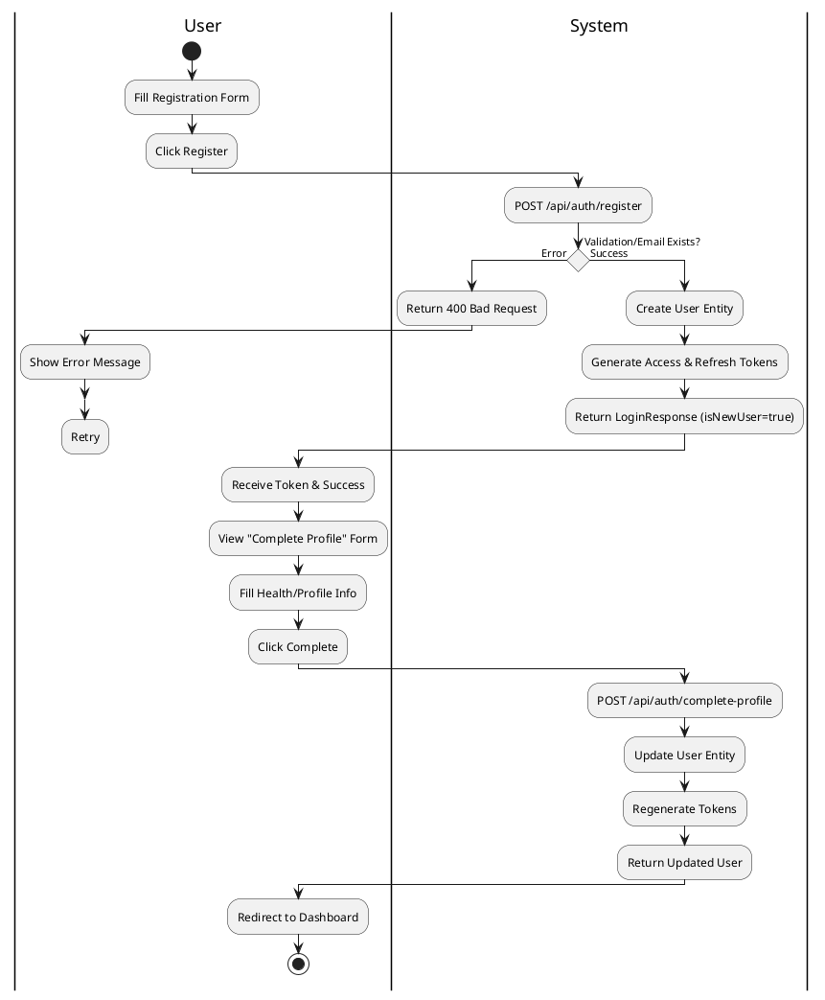
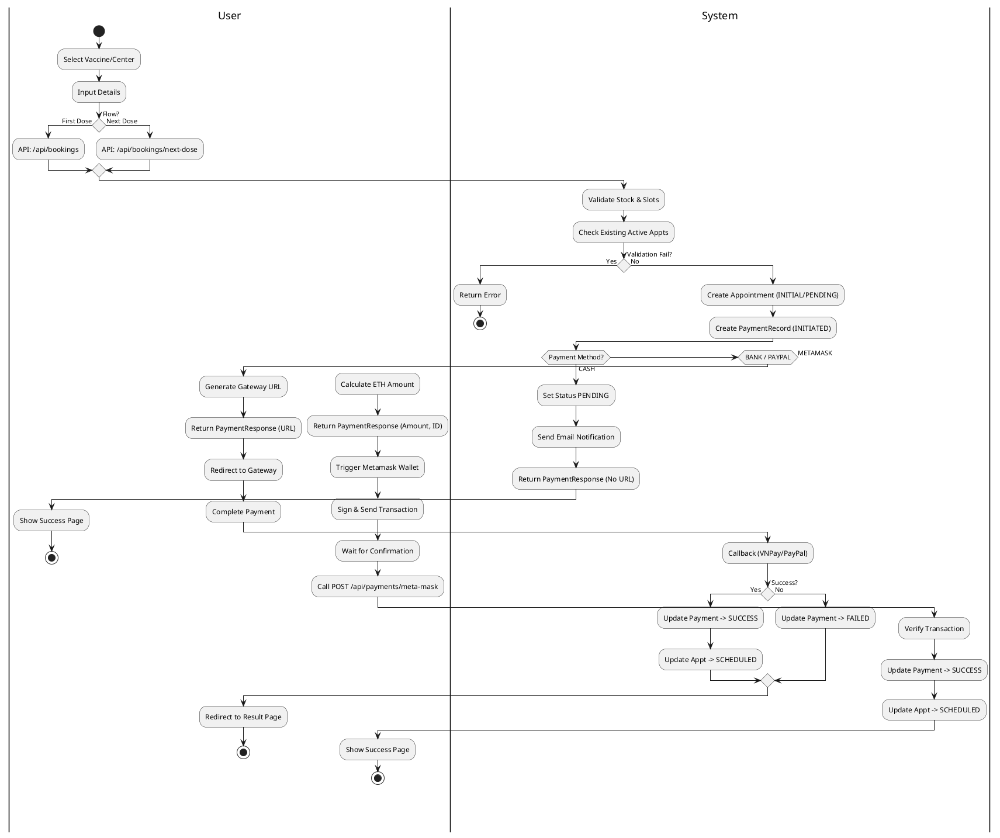
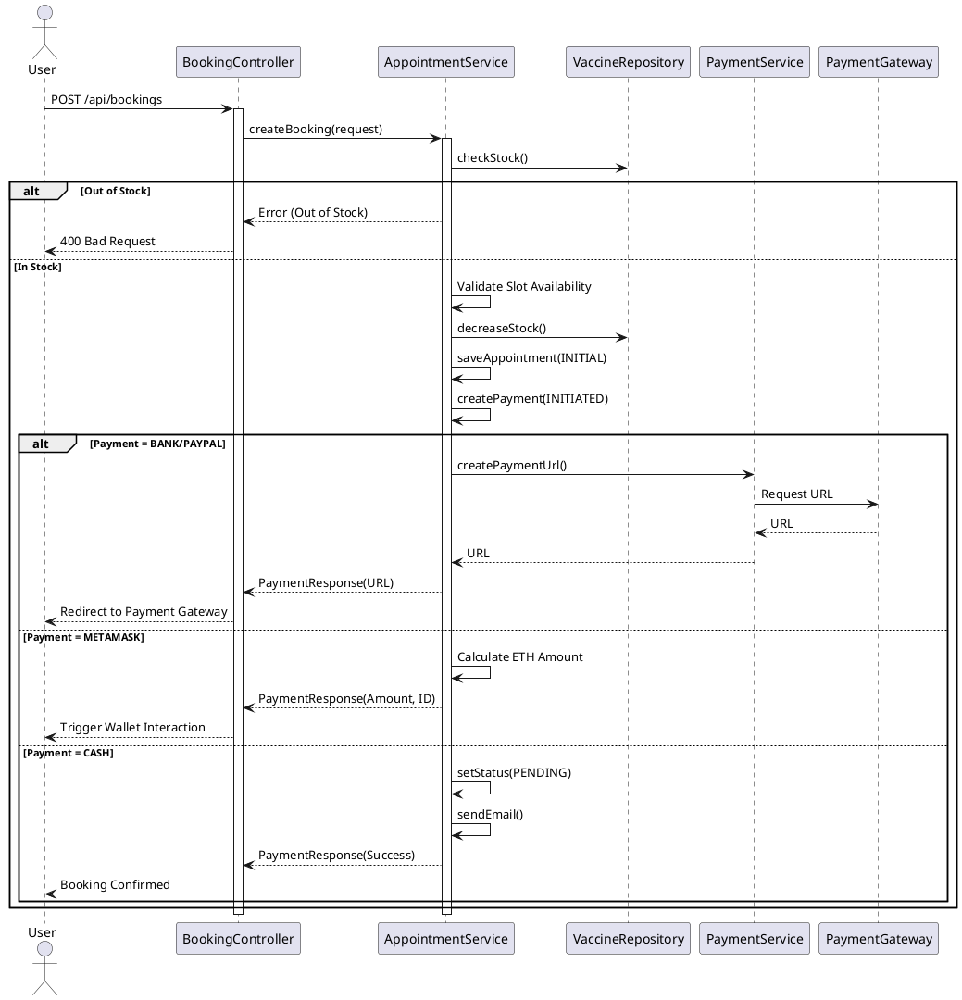
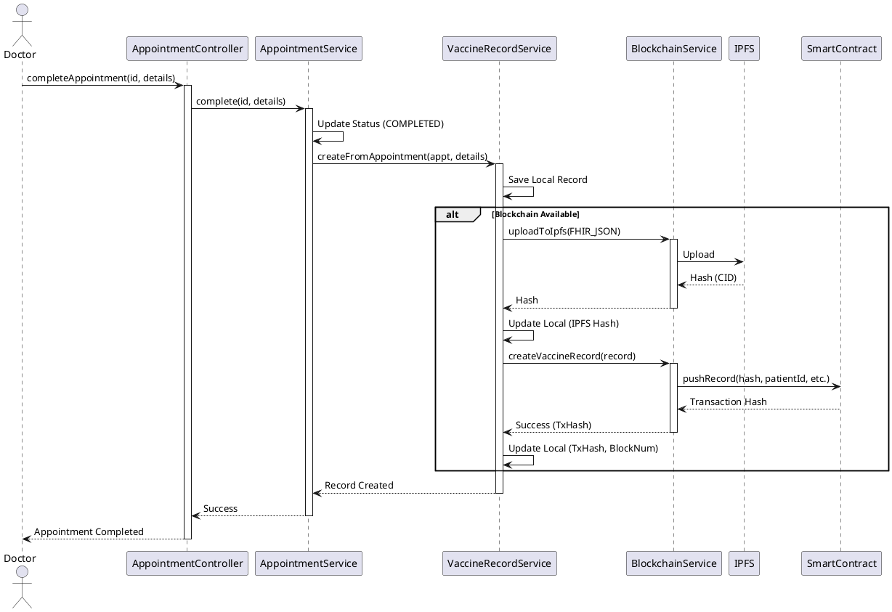
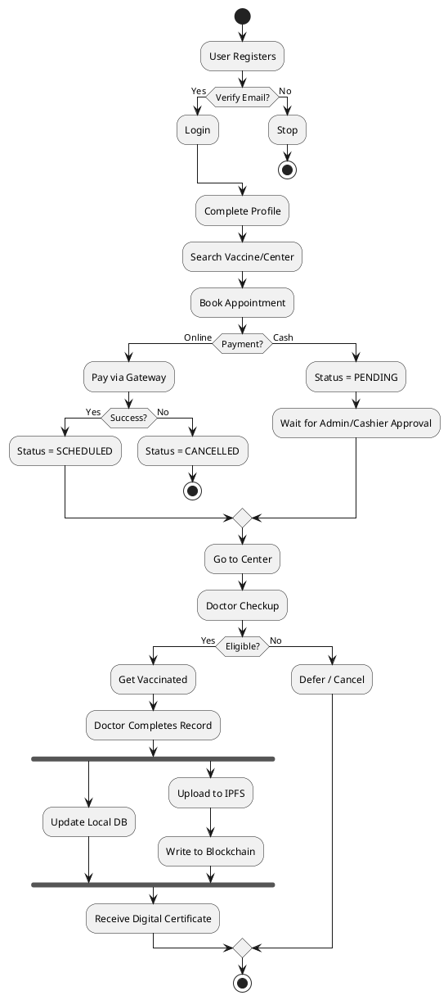

# Activity Diagrams (PlantUML)

## 1. Verification Process
Based on `PublicVerificationController` and `VaccineRecordService`.

## 2. User Registration Flow
Based on `AuthController`.

## 3. Vaccine Booking Flow
Based on `BookingController` and `AppointmentService`.

## 4. Booking Sequence Diagram
Based on `BookingController` and `AppointmentService`.

## 5. Blockchain Recording Sequence Diagram
Based on process in `VaccineRecordService`.

## 6. Overall System Flowchart
General process flow from registration to certification.

