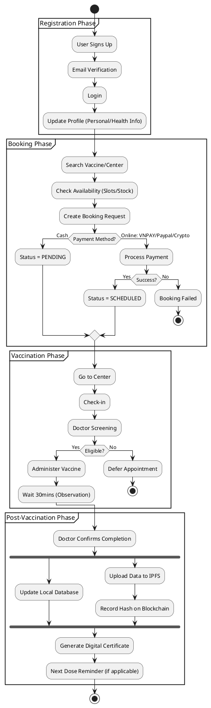

# Overall System Flowchart

```plantuml
@startuml
start

partition "Registration Phase" {
  :User Signs Up;
  :Email Verification;
  :Login;
  :Update Profile (Personal/Health Info);
}

partition "Booking Phase" {
  :Search Vaccine/Center;
  :Check Availability (Slots/Stock);
  :Create Booking Request;
  
  if (Payment Method?) then (Cash)
    :Status = PENDING;
  else (Online: VNPAY/Paypal/Crypto)
    :Process Payment;
    if (Success?) then (Yes)
      :Status = SCHEDULED;
    else (No)
      :Booking Failed;
      stop
    endif
  endif
}

partition "Vaccination Phase" {
  :Go to Center;
  :Check-in;
  :Doctor Screening;
  
  if (Eligible?) then (Yes)
    :Administer Vaccine;
    :Wait 30mins (Observation);
  else (No)
    :Defer Appointment;
    stop
  endif
}

partition "Post-Vaccination Phase" {
  :Doctor Confirms Completion;
  fork
    :Update Local Database;
  fork again
    :Upload Data to IPFS;
    :Record Hash on Blockchain;
  end fork
  :Generate Digital Certificate;
  :Next Dose Reminder (if applicable);
}

stop
@enduml
```
