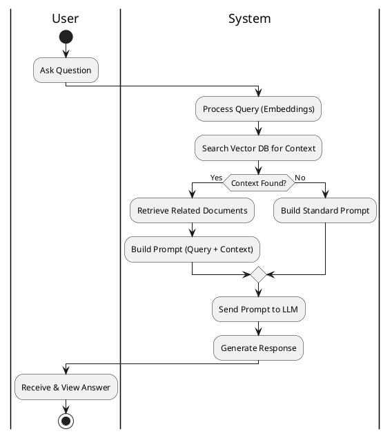

# AI Chatbot (RAG) Activity Diagram

This diagram illustrates the Retrieval-Augmented Generation process.

```plantuml
@startuml
|User|
start
:Ask Question;

|System|
:Process Query (Embeddings);
:Search Vector DB for Context;

if (Context Found?) then (Yes)
  :Retrieve Related Documents;
  :Build Prompt (Query + Context);
else (No)
  :Build Standard Prompt;
endif

:Send Prompt to LLM;
:Generate Response;

|User|
:Receive & View Answer;
stop
@enduml
```
