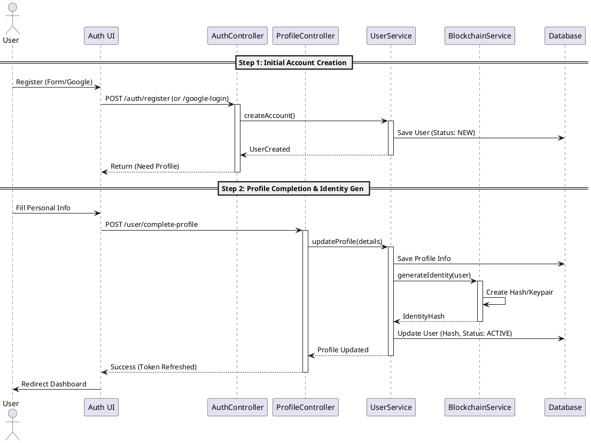

# Registration & Onboarding Sequence Diagram

This diagram details the sequence from initial registration to blockchain identity generation.

```plantuml
@startuml
actor User
participant "Auth UI" as UI
participant "AuthController" as AC
participant "ProfileController" as PC
participant "UserService" as US
participant "BlockchainService" as BS
participant "Database" as DB

== Step 1: Initial Account Creation ==
User -> UI: Register (Form/Google)
UI -> AC: POST /auth/register (or /google-login)
activate AC

AC -> US: createAccount()
activate US
US -> DB: Save User (Status: NEW)
US --> AC: UserCreated
deactivate US

AC --> UI: Return (Need Profile)
deactivate AC

== Step 2: Profile Completion & Identity Gen ==
User -> UI: Fill Personal Info
UI -> PC: POST /user/complete-profile
activate PC

PC -> US: updateProfile(details)
activate US
US -> DB: Save Profile Info

US -> BS: generateIdentity(user)
activate BS
BS -> BS: Create Hash/Keypair
BS --> US: IdentityHash
deactivate BS

US -> DB: Update User (Hash, Status: ACTIVE)
US --> PC: Profile Updated
deactivate US

PC --> UI: Success (Token Refreshed)
deactivate PC

UI -> User: Redirect Dashboard
@enduml
```
