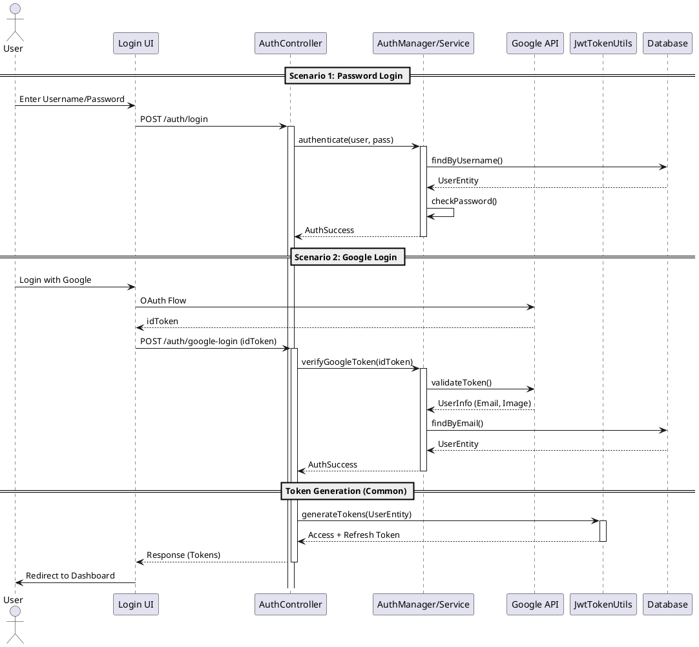

# Login Sequence Diagram

This diagram covers both traditional Password Login and Google OAuth Login.

```plantuml
@startuml
actor User
participant "Login UI" as UI
participant "AuthController" as AC
participant "AuthManager/Service" as AS
participant "Google API" as GOOGLE
participant "JwtTokenUtils" as JWT
participant "Database" as DB

== Scenario 1: Password Login ==
User -> UI: Enter Username/Password
UI -> AC: POST /auth/login
activate AC
AC -> AS: authenticate(user, pass)
activate AS
AS -> DB: findByUsername()
DB --> AS: UserEntity
AS -> AS: checkPassword()
AS --> AC: AuthSuccess
deactivate AS

== Scenario 2: Google Login ==
User -> UI: Login with Google
UI -> GOOGLE: OAuth Flow
GOOGLE --> UI: idToken
UI -> AC: POST /auth/google-login (idToken)
activate AC
AC -> AS: verifyGoogleToken(idToken)
activate AS
AS -> GOOGLE: validateToken()
GOOGLE --> AS: UserInfo (Email, Image)
AS -> DB: findByEmail()
DB --> AS: UserEntity
AS --> AC: AuthSuccess
deactivate AS

== Token Generation (Common) ==
AC -> JWT: generateTokens(UserEntity)
activate JWT
JWT --> AC: Access + Refresh Token
deactivate JWT

AC --> UI: Response (Tokens)
deactivate AC

UI -> User: Redirect to Dashboard
@enduml
```
