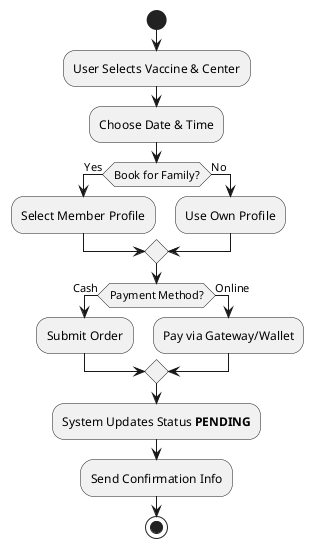
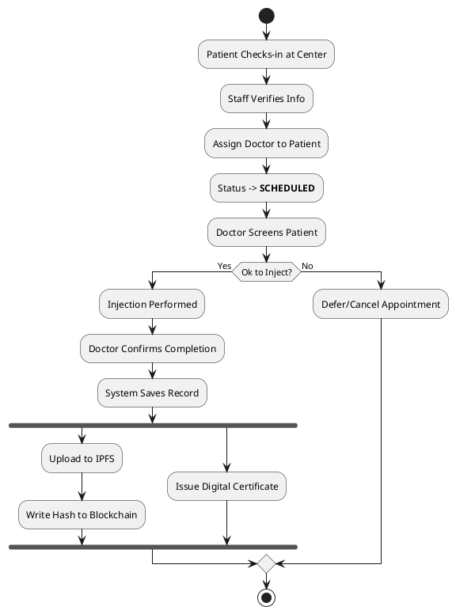
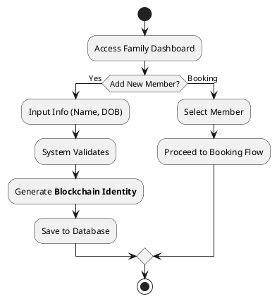
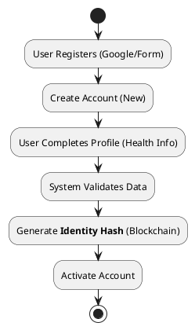
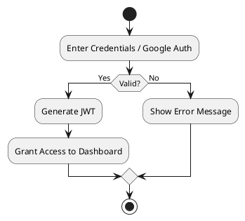
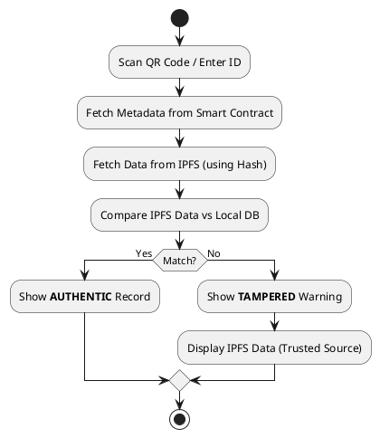

# System Process Flowcharts

This file contains simplified flowcharts for key system processes.

## 1. Booking Process Flowchart

## 2. Clinical Process Flowchart Diagram

## 3. Family Member Management Flowchart Diagram

## 4. Registration & Onboarding Flowchart Diagram

## 5. Login Flowchart Diagram

## 6. Verification Flowchart Diagram

