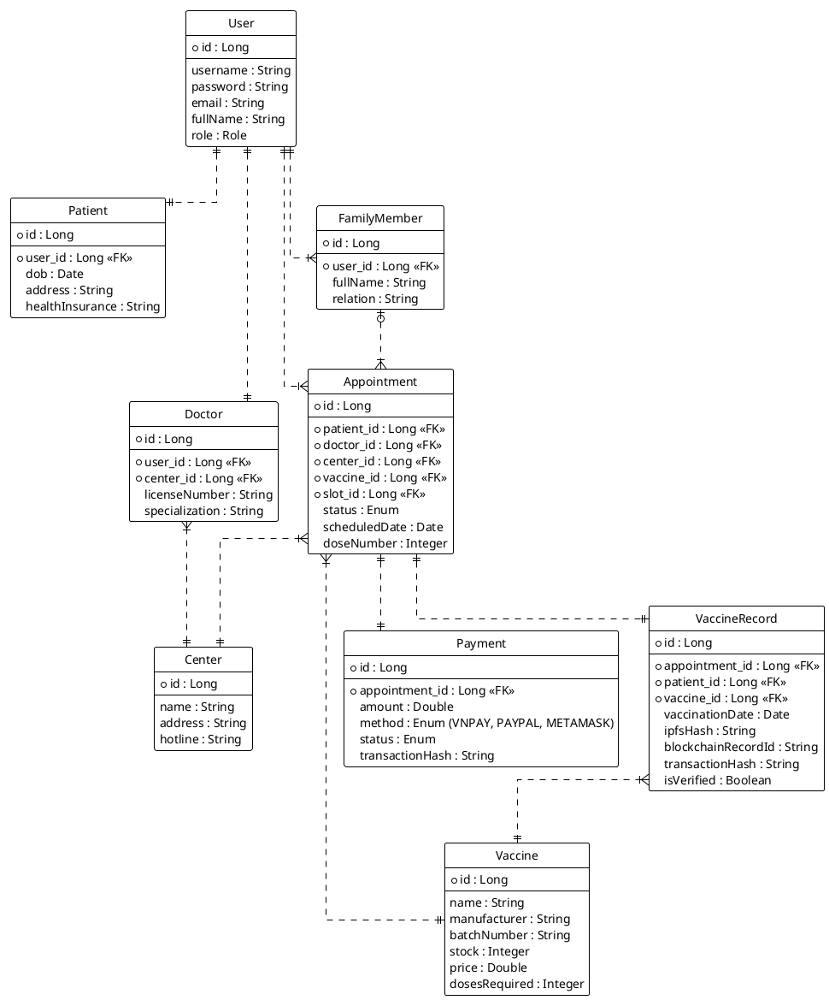

# Entity Relationship Diagram (ERD)

```plantuml
@startuml
!theme plain
hide circle
skinparam linetype ortho

entity "User" as user {
  *id : Long
  --
  username : String
  password : String
  email : String
  fullName : String
  role : Role
}

entity "Patient" as patient {
    *id : Long
    --
    *user_id : Long <<FK>>
    dob : Date
    address : String
    healthInsurance : String
}

entity "Doctor" as doctor {
  *id : Long
  --
  *user_id : Long <<FK>>
  *center_id : Long <<FK>>
  licenseNumber : String
  specialization : String
}

entity "Center" as center {
  *id : Long
  --
  name : String
  address : String
  hotline : String
}

entity "Vaccine" as vaccine {
  *id : Long
  --
  name : String
  manufacturer : String
  batchNumber : String
  stock : Integer
  price : Double
  dosesRequired : Integer
}

entity "Appointment" as appointment {
  *id : Long
  --
  *patient_id : Long <<FK>>
  *doctor_id : Long <<FK>>
  *center_id : Long <<FK>>
  *vaccine_id : Long <<FK>>
  *slot_id : Long <<FK>>
  status : Enum
  scheduledDate : Date
  doseNumber : Integer
}

entity "Payment" as payment {
  *id : Long
  --
  *appointment_id : Long <<FK>>
  amount : Double
  method : Enum (VNPAY, PAYPAL, METAMASK)
  status : Enum
  transactionHash : String
}

entity "VaccineRecord" as record {
  *id : Long
  --
  *appointment_id : Long <<FK>>
  *patient_id : Long <<FK>>
  *vaccine_id : Long <<FK>>
  vaccinationDate : Date
  ipfsHash : String
  blockchainRecordId : String
  transactionHash : String
  isVerified : Boolean
}

entity "FamilyMember" as family {
  *id : Long
  --
  *user_id : Long <<FK>>
  fullName : String
  relation : String
}

user ||..|| patient
user ||..|| doctor
doctor }|..|| center
user ||..|{ family
user ||..|{ appointment
family |o..|{ appointment
appointment }|..|| center
appointment }|..|| vaccine
appointment ||..|| payment
appointment ||..|| record
record }|..|| vaccine

@enduml
```
