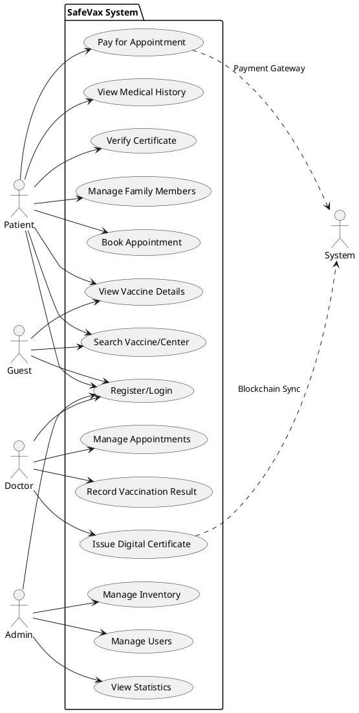

# Use Case Diagram

```plantuml
@startuml
left to right direction
actor "Guest" as g
actor "Patient" as p
actor "Doctor" as d
actor "Admin" as a
actor "System" as s

package "SafeVax System" {
  usecase "Register/Login" as UC1
  usecase "Search Vaccine/Center" as UC2
  usecase "View Vaccine Details" as UC3
  
  usecase "Manage Family Members" as UC4
  usecase "Book Appointment" as UC5
  usecase "Pay for Appointment" as UC6
  usecase "View Medical History" as UC7
  usecase "Verify Certificate" as UC8
  
  usecase "Manage Appointments" as UC9
  usecase "Record Vaccination Result" as UC10
  usecase "Issue Digital Certificate" as UC11
  
  usecase "Manage Inventory" as UC12
  usecase "Manage Users" as UC13
  usecase "View Statistics" as UC14
}

g --> UC1
g --> UC2
g --> UC3

p --> UC1
p --> UC2
p --> UC3
p --> UC4
p --> UC5
p --> UC6
p --> UC7
p --> UC8

d --> UC1
d --> UC9
d --> UC10
d --> UC11

a --> UC1
a --> UC12
a --> UC13
a --> UC14

UC11 ..> s : "Blockchain Sync"
UC6 ..> s : "Payment Gateway"
@enduml
```
