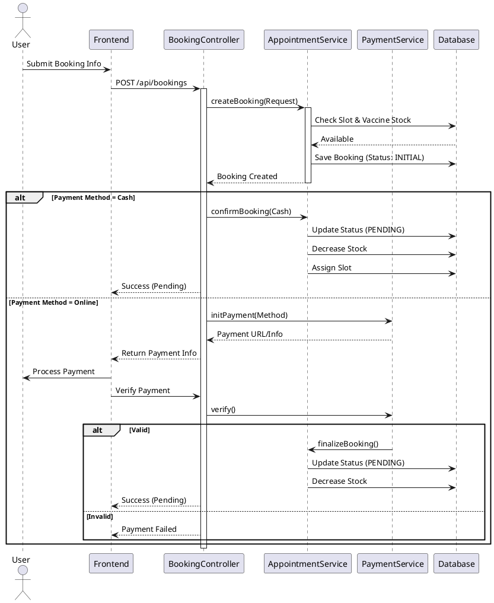

```plantuml
@startuml
actor User
participant "Frontend" as FE
participant "BookingController" as BC
participant "AppointmentService" as AS
participant "PaymentService" as PS
participant "Database" as DB

User -> FE: Submit Booking Info
FE -> BC: POST /api/bookings
activate BC

BC -> AS: createBooking(Request)
activate AS

AS -> DB: Check Slot & Vaccine Stock
DB --> AS: Available

AS -> DB: Save Booking (Status: INITIAL)
AS --> BC: Booking Created
deactivate AS

alt Payment Method = Cash
    BC -> AS: confirmBooking(Cash)
    AS -> DB: Update Status (PENDING)
    AS -> DB: Decrease Stock
    AS -> DB: Assign Slot
    BC --> FE: Success (Pending)
else Payment Method = Online
    BC -> PS: initPayment(Method)
    PS --> BC: Payment URL/Info
    BC --> FE: Return Payment Info
    
    FE -> User: Process Payment
    FE -> BC: Verify Payment
    BC -> PS: verify()
    
    alt Valid
        PS -> AS: finalizeBooking()
        AS -> DB: Update Status (PENDING)
        AS -> DB: Decrease Stock
        BC --> FE: Success (Pending)
    else Invalid
        BC --> FE: Payment Failed
    end
end
deactivate BC
@enduml
```
