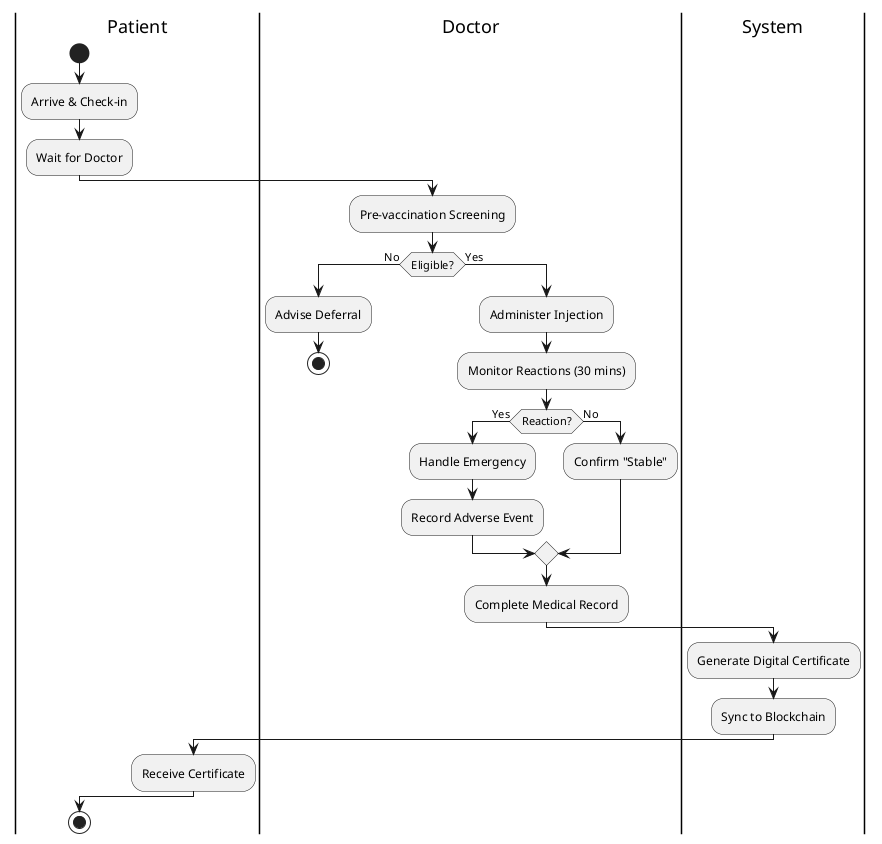

# Vaccination Process Activity Diagram

```plantuml
@startuml
|Patient|
start
:Arrive & Check-in;
:Wait for Doctor;

|Doctor|
:Pre-vaccination Screening;

if (Eligible?) then (No)
  :Advise Deferral;
  stop
else (Yes)
  :Administer Injection;
  :Monitor Reactions (30 mins);
  
  if (Reaction?) then (Yes)
    :Handle Emergency;
    :Record Adverse Event;
  else (No)
    :Confirm "Stable";
  endif
  
  :Complete Medical Record;
  |System|
  :Generate Digital Certificate;
  :Sync to Blockchain;
  
  |Patient|
  :Receive Certificate;
endif
stop
@enduml
```
