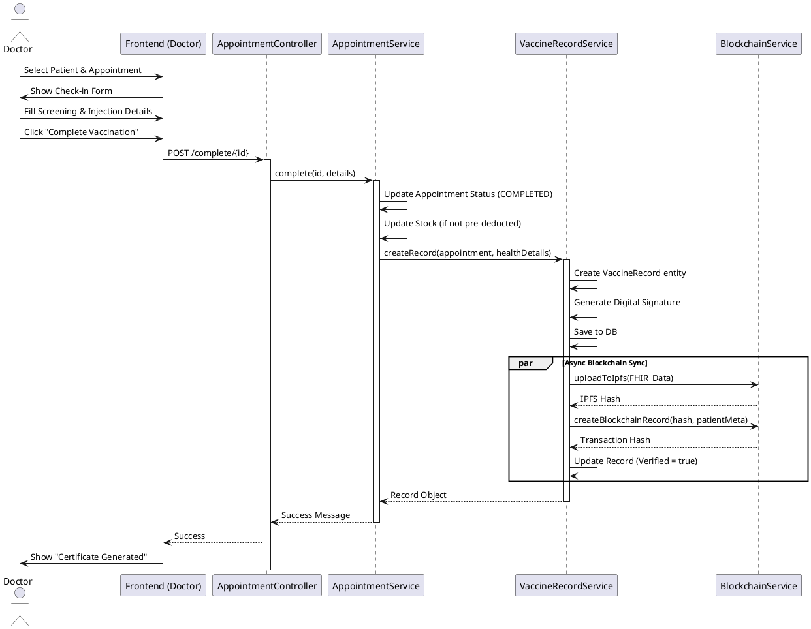

# Vaccination Process Sequence Diagram

```plantuml
@startuml
actor "Doctor" as Doc
participant "Frontend (Doctor)" as FE
participant "AppointmentController" as AC
participant "AppointmentService" as AS
participant "VaccineRecordService" as VRS
participant "BlockchainService" as BS

Doc -> FE: Select Patient & Appointment
FE -> Doc: Show Check-in Form
Doc -> FE: Fill Screening & Injection Details
Doc -> FE: Click "Complete Vaccination"

FE -> AC: POST /complete/{id}
activate AC
AC -> AS: complete(id, details)
activate AS

AS -> AS: Update Appointment Status (COMPLETED)
AS -> AS: Update Stock (if not pre-deducted)

AS -> VRS: createRecord(appointment, healthDetails)
activate VRS
VRS -> VRS: Create VaccineRecord entity
VRS -> VRS: Generate Digital Signature
VRS -> VRS: Save to DB

par Async Blockchain Sync
    VRS -> BS: uploadToIpfs(FHIR_Data)
    BS --> VRS: IPFS Hash
    
    VRS -> BS: createBlockchainRecord(hash, patientMeta)
    BS --> VRS: Transaction Hash
    
    VRS -> VRS: Update Record (Verified = true)
end

VRS --> AS: Record Object
deactivate VRS

AS --> AC: Success Message
deactivate AS

AC --> FE: Success
FE -> Doc: Show "Certificate Generated"
@enduml
```
