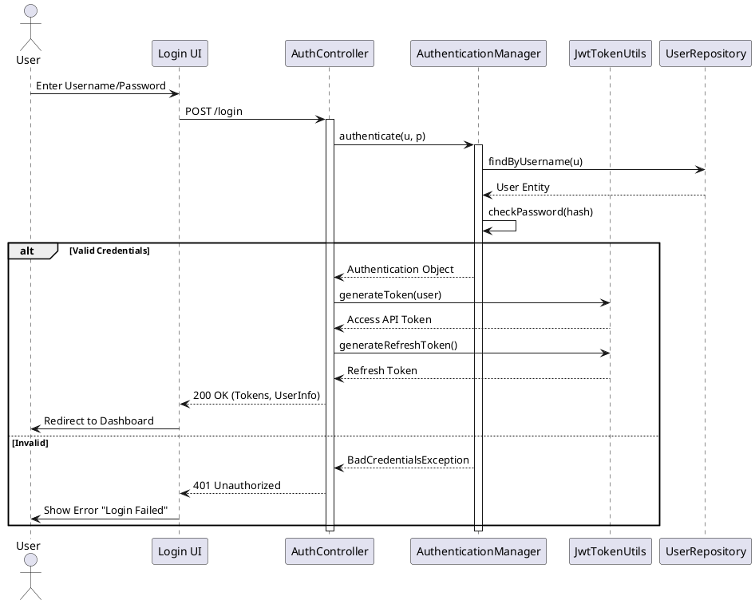

# Authentication Sequence Diagram

```plantuml
@startuml
actor User
participant "Login UI" as UI
participant "AuthController" as AC
participant "AuthenticationManager" as AM
participant "JwtTokenUtils" as JWT
participant "UserRepository" as Repo

User -> UI: Enter Username/Password
UI -> AC: POST /login
activate AC

AC -> AM: authenticate(u, p)
activate AM
AM -> Repo: findByUsername(u)
Repo --> AM: User Entity
AM -> AM: checkPassword(hash)
alt Valid Credentials
    AM --> AC: Authentication Object
    
    AC -> JWT: generateToken(user)
    JWT --> AC: Access API Token
    
    AC -> JWT: generateRefreshToken()
    JWT --> AC: Refresh Token
    
    AC --> UI: 200 OK (Tokens, UserInfo)
    UI -> User: Redirect to Dashboard
else Invalid
    AM --> AC: BadCredentialsException
    AC --> UI: 401 Unauthorized
    UI -> User: Show Error "Login Failed"
end
deactivate AM
deactivate AC
@enduml
```
