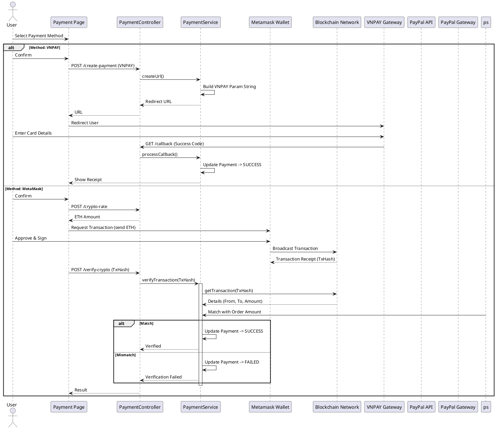

# Payment Sequence Diagram

```plantuml
@startuml
actor User
participant "Payment Page" as UI
participant "PaymentController" as PC
participant "PaymentService" as PS
participant "Metamask Wallet" as Wallet
participant "Blockchain Network" as Eth
participant "VNPAY Gateway" as VNPAY
participant "PayPal API" as PP_API
participant "PayPal Gateway" as PP_Gate

User -> UI: Select Payment Method

alt Method: VNPAY
    User -> UI: Confirm
    UI -> PC: POST /create-payment (VNPAY)
    PC -> PS: createUrl()
    PS -> PS: Build VNPAY Param String
    PS --> PC: Redirect URL
    PC --> UI: URL
    UI -> VNPAY: Redirect User
    User -> VNPAY: Enter Card Details
    VNPAY -> PC: GET /callback (Success Code)
    PC -> PS: processCallback()
    PS -> PS: Update Payment -> SUCCESS
    PS --> UI: Show Receipt
else Method: MetaMask
    User -> UI: Confirm
    UI -> PC: POST /crypto-rate
    PC --> UI: ETH Amount
    
    UI -> Wallet: Request Transaction (send ETH)
    User -> Wallet: Approve & Sign
    Wallet -> Eth: Broadcast Transaction
    Eth --> Wallet: Transaction Receipt (TxHash)
    
    UI -> PC: POST /verify-crypto (TxHash)
    PC -> PS: verifyTransaction(TxHash)
    activate PS
    PS -> Eth: getTransaction(TxHash)
    Eth --> PS: Details (From, To, Amount)
    
    ps -> PS: Match with Order Amount
    alt Match
        PS -> PS: Update Payment -> SUCCESS
        PS --> PC: Verified
    else Mismatch
        PS -> PS: Update Payment -> FAILED
        PS --> PC: Verification Failed
    end
    deactivate PS
    
    PC --> UI: Result
end
@enduml
```
