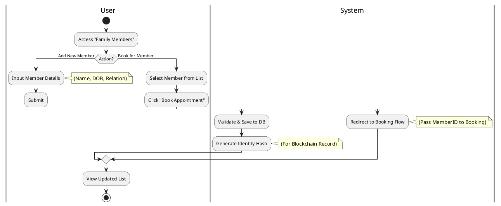

# Family Member Management Activity Diagram

```plantuml
@startuml
|User|
start
:Access "Family Members";

if (Action?) then (Add New Member)
  :Input Member Details;
  note right
    (Name, DOB, Relation)
  end note
  :Submit;
  
  |System|
  :Validate & Save to DB;
  :Generate Identity Hash;
  note right
    (For Blockchain Record)
  end note
  
else (Book for Member)
  |User|
  :Select Member from List;
  :Click "Book Appointment";
  
  |System|
  :Redirect to Booking Flow;
  note right
    (Pass MemberID to Booking)
  end note
endif

|User|
:View Updated List;
stop
@enduml
```
