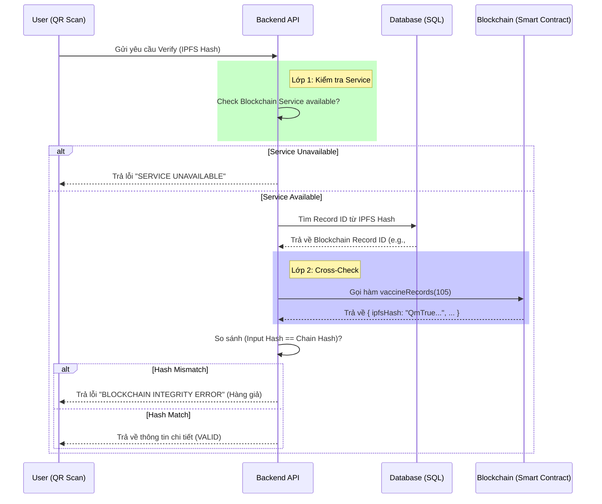

# Giải Pháp Xác Thực Vaccine: Cross-Check với Blockchain

Tài liệu này mô tả chi tiết giải pháp xác thực hồ sơ tiêm chủng (Vaccine Record) bằng cách đối chiếu chéo (Cross-Check) giữa mã Hash IPFS và dữ liệu bất biến trên Blockchain.

## 1. Vấn đề (Problem)
Trước khi áp dụng giải pháp này, quy trình xác thực chỉ dựa trên việc kiểm tra tính toàn vẹn của file (Data Integrity) trên IPFS:
- **Cũ:** Người dùng gửi IPFS Hash -> Hệ thống kiểm tra Hash có tồn tại và khớp với file không -> **VALID**.
- **Lỗ hổng:** Kẻ xấu có thể tự tạo một file JSON giả mạo, upload lên IPFS để lấy Hash hợp lệ, sau đó in mã QR chứa Hash giả này. Hệ thống cũ sẽ báo xanh (VALID) vì file IPFS đó hoàn toàn "toàn vẹn", nhưng nó không phải là file do cơ quan y tế phát hành.

## 2. Giải pháp (Solution)
Để đảm bảo tính xác thực nguồn gốc (Authenticity), hệ thống được nâng cấp để thực hiện **"Quy trình xác minh 2 lớp" (Two-Layer Verification)**.

### Nguyên tắc cốt lõi:
> "Một bản ghi chỉ được coi là hợp lệ khi và chỉ khi Hash của nó được lưu trữ bất biến trên Smart Contract của Blockchain bởi một địa chỉ ví bác sĩ được ủy quyền."

## 3. Quy trình chi tiết (Workflow)



## 4. Chi tiết triển khai (Implementation)

Logic xác thực nằm trong `VaccineRecordService.java`, phương thức `getRecordByIpfsHash`.

### Các bước xử lý trong Code:
1.  **Service Check:** Kiểm tra `isBlockchainServiceAvailable()`. Nếu service blockchain đang bảo trì hoặc mất kết nối, hệ thống từ chối verify để tránh rủi ro bảo mật.
2.  **Database Lookup:** Truy vấn Database cục bộ để lấy `BlockchainRecordId`. Nếu bản ghi chỉ có trong DB mà chưa có ID Blockchain, hệ thống coi là "UNVERIFIED".
3.  **On-Chain Query:** Sử dụng `blockchainService.getVaccineRecord(id)` để lấy dữ liệu gốc từ Smart Contract.
4.  **Integrity Check:**
    ```java
    if (!ipfsHash.equalsIgnoreCase(chainIpfsHash)) {
        throw new AppException("BLOCKCHAIN INTEGRITY ERROR...");
    }
    ```
    Đây là bước quan trọng nhất. Nếu Hash trên QR code khác dù chỉ 1 ký tự so với Hash được lưu trên Blockchain, hồ sơ bị coi là giả mạo.

## 5. Các trường hợp lỗi & Mã phản hồi

| Trường hợp | HTTP Code | Message | Ý nghĩa |
| :--- | :--- | :--- | :--- |
| **Thành công** | 200 OK | (JSON Data) | Hồ sơ thật, khớp 100% với Blockchain. |
| **Không tìm thấy** | 404 | Vaccine record not found... | Hash này chưa từng được hệ thống ghi nhận. |
| **Blockchain Tạch** | 503 | SERVICE UNAVAILABLE | Không kết nối được với Blockchain Node. |
| **Hàng Fake** | 400 | BLOCKCHAIN INTEGRITY ERROR | Hash hợp lệ IPFS nhưng **không trùng** với Hash trên Chain. |
| **Chưa đồng bộ** | 400 | UNVERIFIED RECORD | Bản ghi mới tạo ở DB, chưa kịp ghi lên Chain. |

## 6. Kết luận
Giải pháp này vá hoàn toàn lỗ hổng giả mạo dữ liệu. IPFS đóng vai trò lưu trữ "Nội dung", còn Blockchain đóng vai trò lưu trữ "Dấu vân tay" để chứng thực nội dung đó chưa bao giờ bị thay đổi kể từ khi bác sĩ đặt bút ký.
